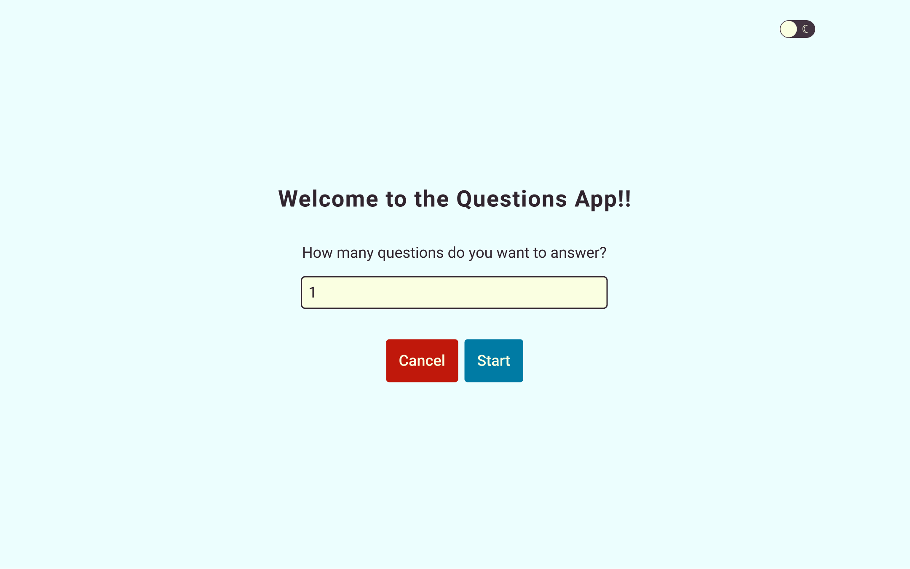

# Questions App

  

## Projeto
A aplicação permite aos usuários gerar quantas perguntas aleatórias quiserem.

## Features
- Gerar perguntas
- Mostrar pontuação
- Mostrar perguntas recentes respondidas

## Tecnologias
Projeto desenvolvido com as seguintes tecnologias:
- [React](https://pt-br.reactjs.org/)
- [TypeScript](https://www.typescriptlang.org/)
- [styled-components](https://styled-components.com/)
- [Formik](https://formik.org/)
- [Axios](https://axios-http.com/)
